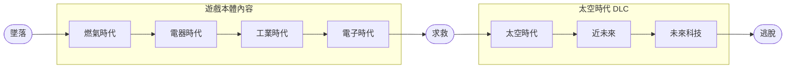

# 簡介
> [!TIP]
> 本文件是暫時性文件，用於統整接下來要撰寫的文件。

# 快速導覽

- [簡介](#簡介)
- [快速導覽](#快速導覽)
- [內容範圍](#內容範圍)
- [結論](#結論)
  - [優點](#優點)
  - [缺點](#缺點)
  - [相關連結](#相關連結)
  - [筆者](#筆者)
    - [主筆](#主筆)
    - [協助檢稿](#協助檢稿)

|
[回到快速導覽](#快速導覽)
|
[回到主題簡介](./Factorio.md)
|
[回到遊戲類別](../Game.md)
|

# 內容範圍
《異星工廠》的遊戲依照科技可以分成多個階段與時代，透過這個方法可以標示出模組的涵蓋範圍。本次介紹的模組涵蓋範圍如下：

# 結論

## 優點

## 缺點

## 相關連結

## 筆者

### 主筆
Lmk999999

### 協助檢稿
無

---

|
[回到快速導覽](#快速導覽)
|
[回到主題簡介](./Factorio.md)
|
[回到遊戲類別](../Game.md)
|
