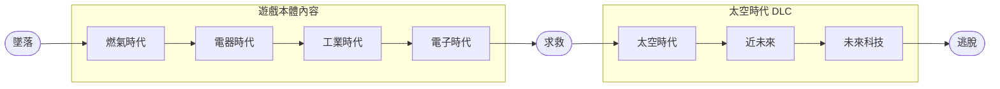

# 簡介
> [!TIP]
> 本文件是暫時性文件，用於統整接下來要撰寫的文件。

《異星工廠》的模組很多樣化，有畫面品質提升的、有管理統計分析的、還有追加遊戲內容的，光靠模組就可以把《異星工廠》的遊戲時間提升到至少本體的 2 倍以上。因此，知道如何安裝模組，會大大改變您遊玩《異星工廠》的體驗。

# 快速導覽

- [簡介](#簡介)
- [快速導覽](#快速導覽)
- [模組的種類](#模組的種類)
- [模組的安裝](#模組的安裝)
  - [透過遊戲內模組管理器安裝](#透過遊戲內模組管理器安裝)
  - [透過模組列表安裝](#透過模組列表安裝)
  - [透過模組檔案安裝](#透過模組檔案安裝)
- [推薦的模組](#推薦的模組)
  - [大型主題模組系列](#大型主題模組系列)
  - [大型主題擴充模組](#大型主題擴充模組)
- [結論](#結論)
  - [優點](#優點)
  - [缺點](#缺點)
  - [相關連結](#相關連結)
  - [筆者](#筆者)
    - [主筆](#主筆)
    - [協助檢稿](#協助檢稿)

|
[回到快速導覽](#快速導覽)
|
[回到主題簡介](./Factorio.md)
|
[回到遊戲類別](../Game.md)
|

# 模組的種類

《異星工廠》的遊戲依照科技可以分成多個階段與時代，透過這個方法可以標示出模組的涵蓋範圍。

除此之外，《異星工廠》的模組也包含提升畫面、改善優化、以及統計等功能的模組，因此對於《異星工廠》這款遊戲來說，模組是多樣化的。

# 模組的安裝
《異星工廠》的模組功能雖然沒有跟 Steam 工作坊進行整合，但是官方自己提供了一個完善的模組網站 [Mod Portal](https://mods.factorio.com/)，並且該網站的內容與遊戲內建的模組管理器整合，使得模組可以自動更新、同步、整合。

## 透過遊戲內模組管理器安裝

## 透過模組列表安裝

## 透過模組檔案安裝

# 推薦的模組

## 大型主題模組系列
|模組名稱|英文名稱（附 [Mod Portal](https://mods.factorio.com/) 連結）|簡稱|作者|修改範圍|備註|
|:---:|:---:|:---:|:---:|:---:|:---|
|AAI 工業|[AAI Industry](https://mods.factorio.com/mod/aai-industry)|AAI|[Earendel](https://mods.factorio.com/user/Earendel)|

## 大型主題擴充模組
以下推薦的模組都有自己明確的主題，同時這些模組大多會使得遊戲時間倍增，在特定情況下進行組合甚至會讓遊戲時間達到十幾倍。

|模組名稱|英文名稱（附 [Mod Portal](https://mods.factorio.com/) 連結）|簡稱|作者|修改範圍|備註|
|:---:|:---:|:---:|:---:|:---:|:---|
|太空探索|[Space Exploration](https://mods.factorio.com/mod/space-exploration)|SE|[Earendel](https://mods.factorio.com/user/Earendel)|
||[Krastorio 2](https://mods.factorio.com/mod/Krastorio2)|K2|[raiguard](https://mods.factorio.com/user/raiguard)|
|工業革命 3|[Industrial Revolution 3](https://mods.factorio.com/mod/IndustrialRevolution3)|IR3|[Deadlock989](https://mods.factorio.com/user/Deadlock989)

# 結論

## 優點

## 缺點

## 相關連結

## 筆者

### 主筆
Lmk999999

### 協助檢稿
無

---

|
[回到快速導覽](#快速導覽)
|
[回到主題簡介](./Factorio.md)
|
[回到遊戲類別](../Game.md)
|
