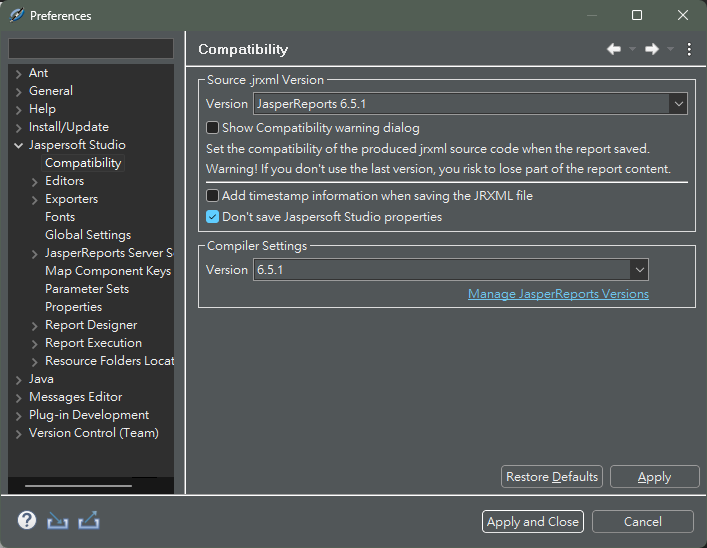

# 簡介
當你終於弄好了 Jaspersoft 和 Eclipse 相關產品的設定的時候，相應的文件必定會出現。

> [!TIP]
> 如果你因為這份文件受惠，請在心中讚嘆筆者十秒鐘。

> [!NOTE]
> 我很痛苦。

> [!NOTE]
> 這就是為什麼我下定決心要買 JetBrains Tool 豪華版年訂閱。

# 快速導覽
- [簡介](#簡介)
- [快速導覽](#快速導覽)
- [Jaspersoft Studio 安裝與設定](#jaspersoft-studio-安裝與設定)
  - [安裝](#安裝)
  - [相容性設定](#相容性設定)
- [結論](#結論)
  - [筆者](#筆者)
    - [主筆](#主筆)
    - [協助檢稿](#協助檢稿)

|
[回到快速導覽](#快速導覽)
|
[回到主題簡介](./Eclipse.md)
|
[回到程式類別](../Program.md)
|

# Jaspersoft Studio 安裝與設定

## 安裝

1. 前往 Jaspersoft 的[官方頁面](https://community.jaspersoft.com/)。
2. 註冊並登入 Jaspersoft 的帳號。
      + 註冊帳號選擇右上的 `Join the Community`。
      + 登入既有帳號選擇右上的 `Sign In`。
3. 前往 Jaspersoft 的[官方下載頁面](https://community.jaspersoft.com/download-jaspersoft/)。
4. 選擇 `Jaspersoft® community edition` 下面的 `Download Now`。
5. 選擇 `Jaspersoft Studio 6.21.3` 標題下面的 `Jaspersoft Studio | Windows`。
6. 點選畫面右邊的 `Download`。
7. 當 `js-studiocomm_6.21.3_windows_x86_64.zip` 壓縮檔下載完畢之後，解壓縮並且將檔案放置在可長時間放置的位置。
8. 典籍解壓縮後檔案內部的 `Jaspersoft Studio.exe`。
9. `Jaspersoft Studio` 會開始執行初始步驟，包括登入帳號。
10. `Jaspersoft Studio` 跑完之後安裝完成。

[回到快速導覽](#快速導覽)

## 相容性設定
為什麼要設定相容性，主要原因如下：
1. Jaspersoft Studio 在 6.6 版本有過一次功能翻新，在該版本前後 JasperReport 的表示方法有顯著的不同。
2. Jaspersoft 官方僅提供最新版本的 Jaspersoft 工具與函式庫，因此需要到另外的地方找到資源，並使其相容。
3. 台灣很多企業很愛使用 Java，因此相關的報表生廠就常會使用到 JasperReport，然後外加普遍存在於華人傳統的「 **能用就好** 」的心態，最終導致可能要使用很早以前版本的 JasperReport 版本。

為了應對以上的狀況，才需要對最新的 Jaspersoft Studio 進行相容性設定，使其能夠編寫舊版的 JasperReport。

> [!NOTE]
> 本文教學環境如下。
> + 作業系統：`Windows 11`
> + 軟體版本：`Jaspersoft Studio 6.21.2`
> + 相容版本：`JasperReport Library 6.5.1`

1. 安裝 `Jaspersoft Studio 6.21.2`，請參閱[該章節](#安裝)。

2. 下載 `JasperReport Library 6.5.1`。
   1. 前往第三方資源網站 [SourceForge](https://sourceforge.net/)。
   2. 搜尋並下載 `JasperReport Library 6.5.1` （[連結點這](https://sourceforge.net/projects/jasperreports/files/archive/jasperreports/JasperReports%206.5.1/)）。
   3. 將下載的檔案存放在可以長期放置的路徑。

3. 設定 `Jaspersoft Studio 6.21.2` 的相容性。
   1. 上方列表，選擇 `Window` ，再選擇 `Preferences`。
   2. 左側選單，選擇 `Jaspersoft Studio` ，再選擇 ` Compatibility`。
   3. 就可以抵達相容性頁面。

      

   4. 設定相容性版本；將 `Source .jrxml Version` 區塊中的 `Version` 設定成 `JasperReport 6.5.1`。
   5. 設定不儲存 Studio 資訊，避免無用的資訊影響舊版本讀取與運行；將 `Don't save Jaspersoft Studio properties.` 選項打勾。
   6. 設定相容函式庫，將要相容的函式庫提供給 Studio，使其作為參考；將 `Compiler Settings` 區塊中的 `Version` 設定成 `6.5.1`。

> [!NOTE]
> 如果沒有 `6.5.1` 的選項，請將下載的 `JasperReport Library 6.5.1` 加入倒 Studio 之中，步驟如下：
> 1. 選擇 `Manage JasperReports Versions`。
> 2. 選擇 `Add From Path`。
> 3. 選擇 `Browse`。
> 4. 選擇 `JasperReport Library 6.5.1` 所放置的路徑資料夾。
> 5. 選擇 `OK`。
>
> 以上步驟結束後，就會看到相應的版本出現在選項中。

4. 設定完畢，接下來問見的編寫都會以 `6.5.1` 的版本運行。

> [!NOTE]
> 本章節參考資料。
> + [Setting Compatibility with Earlier Versions of JasperReports Library](https://community.jaspersoft.com/documentation_/jaspersoft-studio-user-guide/v820/jss-user-_-compatibility-with-earlier-versions/)

[回到快速導覽](#快速導覽)

# 結論

## 筆者

### 主筆
Lmk999999

### 協助檢稿
無

|
[回到快速導覽](#快速導覽)
|
[回到主題簡介](./Eclipse.md)
|
[回到程式類別](../Program.md)
|
